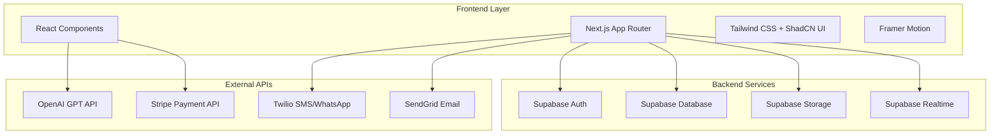

# Design Document

## Overview

GetReference is a full-stack web application built with Next.js, Supabase, and AI integration that facilitates recommendation letter requests between students and lecturers. The system uses a modern tech stack with mobile-first responsive design, secure authentication, payment processing, and AI-assisted content generation.

## Architecture

### High-Level Architecture



### Technology Stack

- **Frontend**: Next.js 14 with App Router, React 18, TypeScript
- **Styling**: Tailwind CSS, ShadCN UI components
- **Animation**: Framer Motion
- **Backend**: Supabase (Auth, Database, Storage, Realtime)
- **Database**: PostgreSQL via Supabase
- **AI**: OpenAI GPT-4 API
- **Payments**: Stripe
- **Notifications**: Twilio (SMS/WhatsApp), SendGrid (Email)
- **Forms**: React Hook Form with Zod validation
- **Data Fetching**: React Query (TanStack Query)
- **Deployment**: Vercel

## Components and Interfaces

### Authentication System

#### User Registration Flow
- **Student Registration**: Multi-step form with document upload
- **Lecturer Registration**: Staff email verification with department selection
- **Email Verification**: Supabase Auth integration
- **Role-based Access**: JWT tokens with role claims

#### Authentication Components
```typescript
interface AuthUser {
  id: string;
  email: string;
  role: 'student' | 'lecturer' | 'admin';
  profile: StudentProfile | LecturerProfile | AdminProfile;
}

interface StudentProfile {
  firstName: string;
  lastName: string;
  enrollmentYear: number;
  completionYear: number;
  transcripts: FileUpload[];
  cv?: FileUpload;
  photo?: FileUpload;
}

interface LecturerProfile {
  firstName: string;
  lastName: string;
  staffNumber: string;
  department: string;
  affiliatedDepartments?: string[];
  employmentYear: number;
  rank: string;
  notificationPreferences: NotificationPreferences;
}
```

### Dashboard System

#### Student Dashboard (`/student/dashboard`)
- **Overview Cards**: Request statistics and status summary
- **Request Management**: Tabbed interface for current/past requests
- **Actions**: View details, reassign requests, file complaints
- **Notifications**: In-app message center

#### Lecturer Dashboard (`/lecturer/dashboard`)
- **Overview Cards**: Pending, accepted, and completed request counts
- **Request Queue**: Prioritized list with "Work Now" actions
- **Sample Letters**: Upload and categorization system
- **Notification Center**: Real-time updates

#### Admin Dashboard (`/admin/dashboard`)
- **User Management**: Search, suspend, reset capabilities
- **Token Management**: Generate vouchers with expiry
- **Analytics**: Charts and metrics visualization
- **Complaint Resolution**: Automated routing and tracking

### Request Management System

#### Request Creation Flow (`/student/new-request`)
```typescript
interface RequestEntity {
  id: string;
  studentId: string;
  purpose: 'school' | 'scholarship' | 'job';
  details: RequestDetails;
  lecturers: string[]; // Max 2 lecturer IDs
  documents: FileUpload[];
  draftLetter?: string;
  additionalNotes?: string;
  deadline: Date;
  status: RequestStatus;
  paymentId?: string;
}

interface RequestDetails {
  recipientName?: string;
  recipientAddress: string;
  programName?: string;
  organizationName: string;
  deliveryMethod: 'self_upload' | 'lecturer_upload' | 'email';
}

type RequestStatus = 
  | 'pending_acceptance'
  | 'accepted'
  | 'in_progress'
  | 'completed'
  | 'declined'
  | 'reassigned';
```

#### Stepper Component
- **Step 1**: Purpose selection
- **Step 2**: Details and recipient information
- **Step 3**: Lecturer selection with AI suggestions
- **Step 4**: Document uploads and draft letter
- **Step 5**: Additional details and delivery preferences
- **Step 6**: Payment processing
- **Step 7**: Confirmation and submission

### AI Integration System

#### Letter Generation Engine
```typescript
interface AILetterGenerator {
  analyzeLecturerStyle(sampleLetters: FileUpload[]): Promise<StyleProfile>;
  generateLetter(request: GenerationRequest): Promise<string>;
  refineLetter(currentLetter: string, feedback: string): Promise<string>;
}

interface GenerationRequest {
  studentProfile: StudentProfile;
  requestDetails: RequestEntity;
  lecturerStyle: StyleProfile;
  attributeRatings: AttributeRatings;
  draftLetter?: string;
}

interface AttributeRatings {
  workEthic: number; // 1-10
  oralExpression: number;
  writtenExpression: number;
  teamwork: number;
  motivation: number;
  criticalThinking: number;
  initiative: number;
  independence: number;
  researchCapability: number;
}
```

#### AI Workflow
1. **Style Analysis**: Process lecturer's sample letters to extract writing patterns
2. **Context Gathering**: Analyze student documents, draft letter, and request details
3. **Letter Generation**: Use GPT-4 with custom prompts incorporating style and ratings
4. **Iterative Refinement**: Allow lecturer feedback for improvements
5. **Final Review**: Lecturer approval before submission

### Payment System

#### Stripe Integration
```typescript
interface PaymentEntity {
  id: string;
  studentId: string;
  requestId: string;
  amount: number; // $30 per request
  currency: 'usd';
  status: 'pending' | 'completed' | 'failed' | 'refunded';
  stripePaymentIntentId: string;
  lecturerPayout?: PayoutEntity;
}

interface PayoutEntity {
  id: string;
  lecturerId: string;
  amount: number; // 75% of payment
  paymentMethod: BankAccount | MobileMoneyAccount;
  status: 'pending' | 'completed' | 'failed';
  transferDate?: Date;
}

interface TokenEntity {
  id: string;
  code: string;
  value: number; // Number of free requests
  expiryDate: Date;
  createdBy: string; // Admin ID
  usedBy?: string; // Student ID
  usedDate?: Date;
}
```

### Notification System

#### Multi-Channel Notifications
```typescript
interface NotificationService {
  sendEmail(recipient: string, template: EmailTemplate, data: any): Promise<void>;
  sendSMS(phoneNumber: string, message: string): Promise<void>;
  sendWhatsApp(phoneNumber: string, message: string): Promise<void>;
  sendInApp(userId: string, notification: InAppNotification): Promise<void>;
}

interface NotificationTrigger {
  event: 'status_change' | 'new_request' | 'reminder' | 'reassignment';
  recipients: string[];
  channels: ('email' | 'sms' | 'whatsapp' | 'in_app')[];
  template: string;
  data: Record<string, any>;
}
```

#### Automated Triggers
- **Status Changes**: Notify relevant parties when request status updates
- **New Requests**: Alert lecturers of incoming requests
- **Reminders**: Weekly reminders for pending requests
- **Reassignments**: Notify both original and new lecturers
- **Completion**: Confirm letter submission to students

## Data Models

### Database Schema

```sql
-- Users table (Supabase Auth extended)
CREATE TABLE profiles (
  id UUID REFERENCES auth.users PRIMARY KEY,
  role TEXT NOT NULL CHECK (role IN ('student', 'lecturer', 'admin')),
  first_name TEXT NOT NULL,
  last_name TEXT NOT NULL,
  created_at TIMESTAMP WITH TIME ZONE DEFAULT NOW(),
  updated_at TIMESTAMP WITH TIME ZONE DEFAULT NOW()
);

-- Student profiles
CREATE TABLE student_profiles (
  id UUID REFERENCES profiles PRIMARY KEY,
  enrollment_year INTEGER NOT NULL,
  completion_year INTEGER NOT NULL,
  contact_info JSONB NOT NULL,
  date_of_birth DATE NOT NULL,
  transcript_urls TEXT[] NOT NULL,
  cv_url TEXT,
  photo_url TEXT
);

-- Lecturer profiles
CREATE TABLE lecturer_profiles (
  id UUID REFERENCES profiles PRIMARY KEY,
  staff_number TEXT UNIQUE NOT NULL,
  department TEXT NOT NULL,
  affiliated_departments TEXT[],
  employment_year INTEGER NOT NULL,
  rank TEXT NOT NULL,
  notification_preferences JSONB NOT NULL,
  payment_details JSONB
);

-- Requests
CREATE TABLE requests (
  id UUID PRIMARY KEY DEFAULT gen_random_uuid(),
  student_id UUID REFERENCES profiles NOT NULL,
  purpose TEXT NOT NULL CHECK (purpose IN ('school', 'scholarship', 'job')),
  details JSONB NOT NULL,
  lecturer_ids UUID[] NOT NULL,
  document_urls TEXT[] NOT NULL,
  draft_letter TEXT,
  additional_notes TEXT,
  deadline DATE NOT NULL,
  status TEXT NOT NULL DEFAULT 'pending_acceptance',
  payment_id UUID,
  created_at TIMESTAMP WITH TIME ZONE DEFAULT NOW(),
  updated_at TIMESTAMP WITH TIME ZONE DEFAULT NOW()
);

-- Letters
CREATE TABLE letters (
  id UUID PRIMARY KEY DEFAULT gen_random_uuid(),
  request_id UUID REFERENCES requests NOT NULL,
  lecturer_id UUID REFERENCES profiles NOT NULL,
  content TEXT NOT NULL,
  attribute_ratings JSONB,
  ai_generated BOOLEAN DEFAULT FALSE,
  submitted_at TIMESTAMP WITH TIME ZONE,
  declaration_completed BOOLEAN DEFAULT FALSE,
  created_at TIMESTAMP WITH TIME ZONE DEFAULT NOW(),
  updated_at TIMESTAMP WITH TIME ZONE DEFAULT NOW()
);

-- Payments
CREATE TABLE payments (
  id UUID PRIMARY KEY DEFAULT gen_random_uuid(),
  student_id UUID REFERENCES profiles NOT NULL,
  request_id UUID REFERENCES requests NOT NULL,
  amount DECIMAL(10,2) NOT NULL,
  currency TEXT NOT NULL DEFAULT 'usd',
  status TEXT NOT NULL DEFAULT 'pending',
  stripe_payment_intent_id TEXT,
  created_at TIMESTAMP WITH TIME ZONE DEFAULT NOW(),
  updated_at TIMESTAMP WITH TIME ZONE DEFAULT NOW()
);

-- Tokens
CREATE TABLE tokens (
  id UUID PRIMARY KEY DEFAULT gen_random_uuid(),
  code TEXT UNIQUE NOT NULL,
  value INTEGER NOT NULL,
  expiry_date DATE NOT NULL,
  created_by UUID REFERENCES profiles NOT NULL,
  used_by UUID REFERENCES profiles,
  used_date TIMESTAMP WITH TIME ZONE,
  created_at TIMESTAMP WITH TIME ZONE DEFAULT NOW()
);

-- Notifications
CREATE TABLE notifications (
  id UUID PRIMARY KEY DEFAULT gen_random_uuid(),
  user_id UUID REFERENCES profiles NOT NULL,
  type TEXT NOT NULL,
  title TEXT NOT NULL,
  message TEXT NOT NULL,
  read BOOLEAN DEFAULT FALSE,
  data JSONB,
  created_at TIMESTAMP WITH TIME ZONE DEFAULT NOW()
);
```

### Row Level Security (RLS) Policies

```sql
-- Students can only access their own data
CREATE POLICY "Students can view own profile" ON student_profiles
  FOR SELECT USING (auth.uid() = id);

-- Lecturers can view requests assigned to them
CREATE POLICY "Lecturers can view assigned requests" ON requests
  FOR SELECT USING (auth.uid() = ANY(lecturer_ids));

-- Students can view their own requests
CREATE POLICY "Students can view own requests" ON requests
  FOR SELECT USING (auth.uid() = student_id);
```

## Error Handling

### Client-Side Error Handling
- **Form Validation**: Zod schemas with React Hook Form
- **API Error Boundaries**: React Error Boundaries for component failures
- **Network Errors**: Retry logic with exponential backoff
- **User Feedback**: Toast notifications and inline error messages

### Server-Side Error Handling
- **API Route Protection**: Middleware for authentication and authorization
- **Database Errors**: Proper error codes and user-friendly messages
- **External API Failures**: Graceful degradation and fallback options
- **File Upload Errors**: Size limits, format validation, and storage failures

### Error Monitoring
- **Logging**: Structured logging with request IDs
- **Alerting**: Critical error notifications to admin
- **User Support**: Error reporting system for user issues

## Testing Strategy

### Unit Testing
- **Components**: React Testing Library for UI components
- **Utilities**: Jest for helper functions and business logic
- **API Routes**: Supertest for endpoint testing
- **Database**: Supabase local development for schema testing

### Integration Testing
- **User Flows**: End-to-end testing with Playwright
- **Payment Processing**: Stripe test mode integration
- **AI Integration**: Mock OpenAI responses for consistent testing
- **Notification System**: Test email/SMS delivery in staging

### Performance Testing
- **Load Testing**: Simulate 1000+ concurrent users
- **Database Performance**: Query optimization and indexing
- **File Upload**: Large document handling and storage limits
- **API Response Times**: Monitor and optimize slow endpoints

### Security Testing
- **Authentication**: Test JWT token handling and expiration
- **Authorization**: Verify role-based access controls
- **Input Validation**: SQL injection and XSS prevention
- **File Security**: Malicious file upload prevention

## Deployment and Infrastructure

### Vercel Deployment
- **Environment Variables**: Secure API key management
- **Build Optimization**: Static generation where possible
- **Edge Functions**: Geographically distributed API routes
- **CDN**: Automatic asset optimization and caching

### Supabase Configuration
- **Database**: Auto-scaling PostgreSQL with connection pooling
- **Storage**: Encrypted file storage with access policies
- **Realtime**: WebSocket connections for live updates
- **Edge Functions**: Server-side logic for complex operations

### Monitoring and Analytics
- **Performance**: Vercel Analytics and Core Web Vitals
- **Errors**: Sentry integration for error tracking
- **Usage**: Custom analytics for business metrics
- **Uptime**: Health checks and status page

### Security Measures
- **HTTPS**: Enforced SSL/TLS encryption
- **CORS**: Proper cross-origin resource sharing
- **Rate Limiting**: API endpoint protection
- **Data Encryption**: Sensitive data encryption at rest
- **Audit Logging**: Comprehensive action tracking